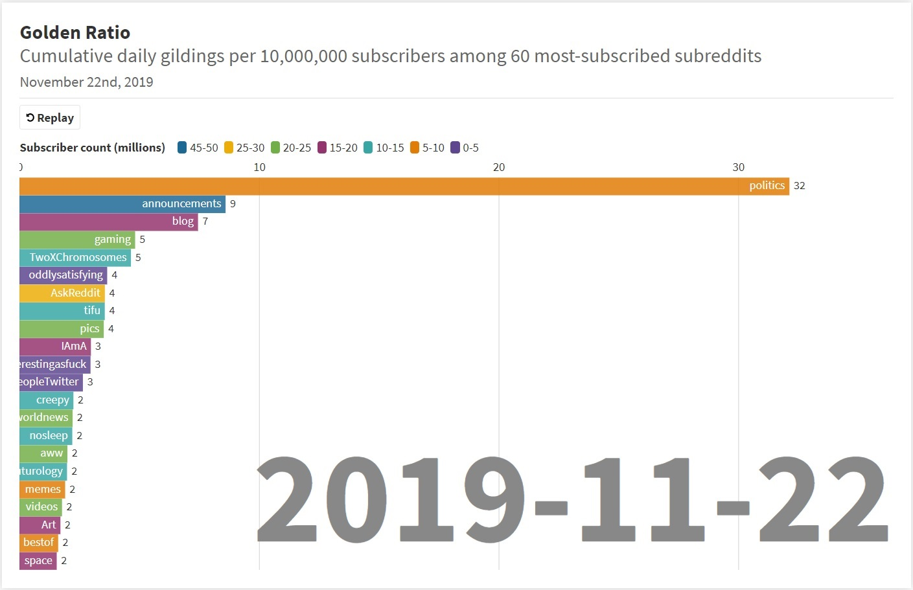

# 2019-11-24 - Top 60 Most Subscribed

This is my first week with the project. I made many improvements over time, but after a week I wanted to share my initial results.

_Note_ I learned early on that smaller subreddits have a much higher gold-to-subscriber ratio, but this week's results do provide insight into which of the "most visible" subreddits are awarding disproportionate amounts of gold.

This data represents posts in the top 60 most-subscribed subreddits from November 16th, 2019 through November 22nd, 2019. The measurement in question is the `cumulative average gildings per 10,000,000 subscribers per day` - a representation of how much gold the subreddit issued relative to its subscription base.

Notice that `r/politics` won by a mile. This week saw public US predential impeachment hearings which may explain the activity.

`r/announcements` always seems to be highly gilded. `r/blog` came in third. After this - you see an evening out of data.

Animation created with Flourish: https://public.flourish.studio/visualisation/983347/