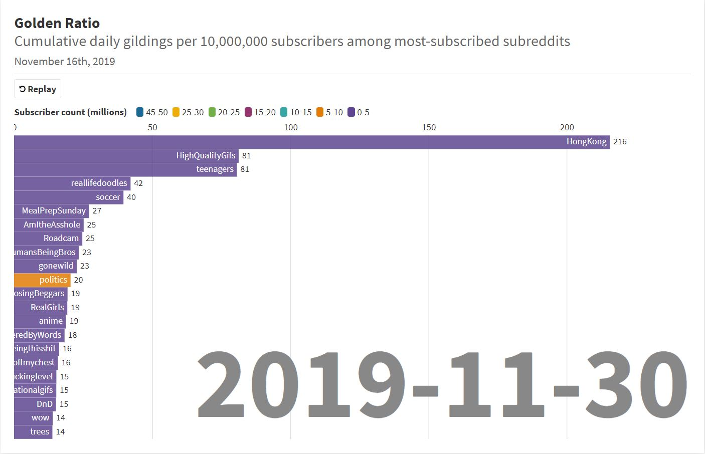

# 2019-12-01 - Top 200 Most Subscribed

This is my second week with the project. 

This data represents posts in the top 200 most-subscribed subreddits* from November 23rd, 2019 through November 30th, 2019. The measurement in question is the `cumulative average gildings per 10,000,000 subscribers per day` - a representation of how much gold the subreddit issued relative to its subscription base.

This week `r/HongKong` took the top spot. This subreddit only has ~500,000 subscribers but I included it since it was a trending subreddit. It's popularity, and it's high gild rates, can be attributed to the massive pro-democracy protests going on in Hong Kong right now.

The other top subreddits are not topical; rather, they are more akin to sources of entertainment: `r/HighQualityGifs`, `r/soccer`, and `r/reallifedoodles`.

Notice that `r/politics` is the only subreddit with more than 5 million subscribers to crack the top 20 highest gild-to-subscriber ratio. In fact, no other subreddit with more than 5 million subscribers appears on this list until `r/announcements` at 33rd place. This disproportionate gilding pattern is a continuation [from last week](/2019-11-24.md).

Animation created with Flourish: https://public.flourish.studio/visualisation/943370/

*In addition to the top 200 most subscribed subreddits, I also added a few of the trending subreddits as indicated by the Reddit homepage.